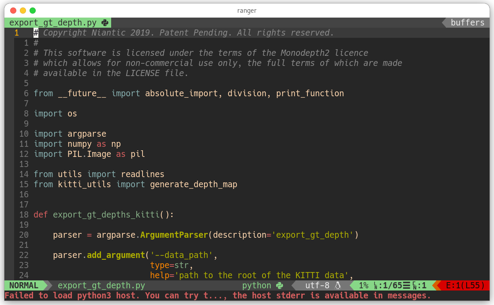
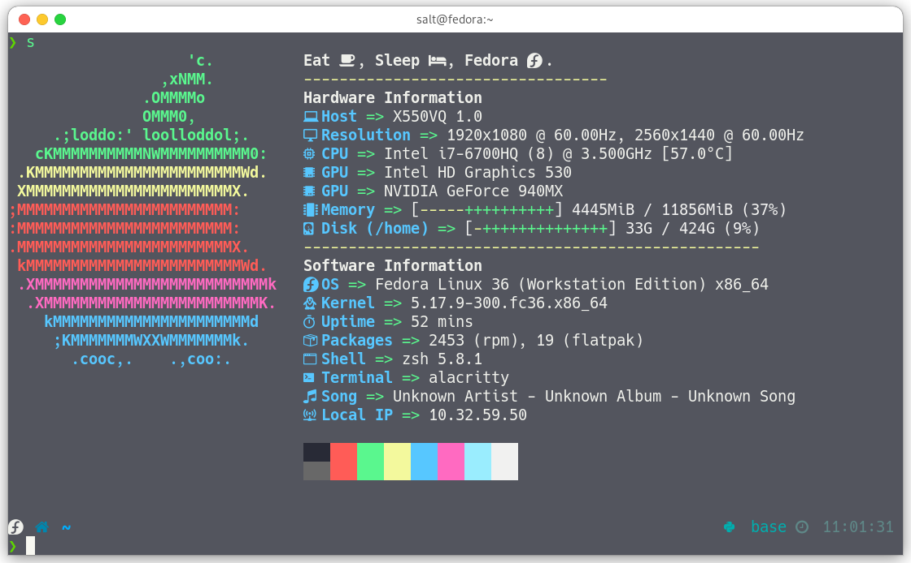
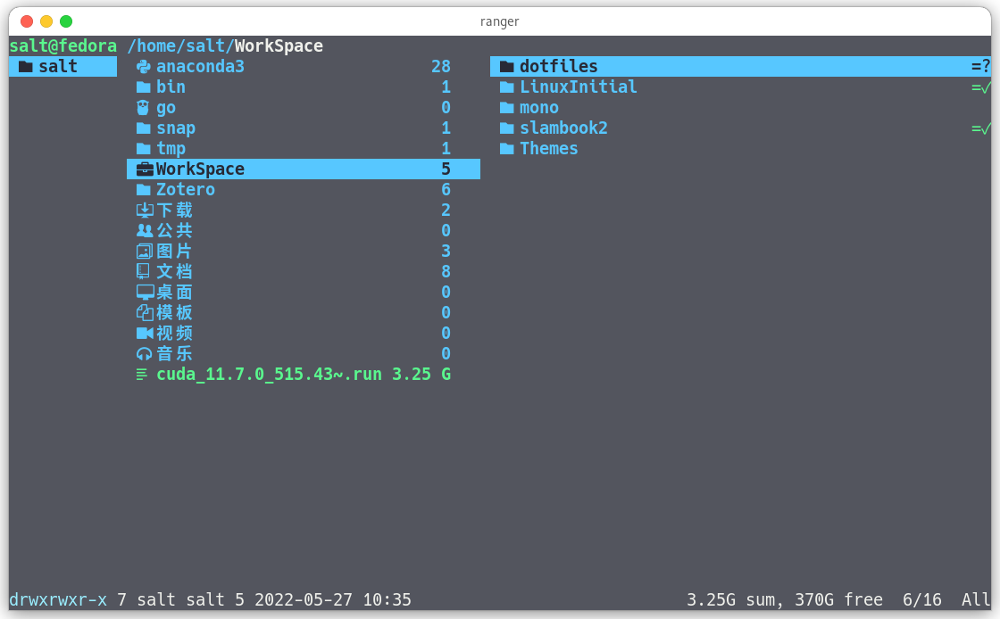

# dotfiles

My Fedora config.

## Specifications

- Terminal: [alacritty](https://github.com/alacritty/alacritty)
- Shell: [zsh](https://github.com/zsh-users/zsh) [ohmyzsh](https://github.com/ohmyzsh/ohmyzsh)
- Editor: [neovim](http://neovim.org/)
- SIT: [neofetch](https://github.com/dylanaraps/neofetch)
- File Manager: [ranger](https://ranger.github.io/)

## Configurations

Here are all of my configuration tutorials:

- [Alacritty](config/alacritty/README.md)
- [Kitty](config/kitty/README.md)
- [NeoVim](config/nvim/README.md)
- [Ranger](config/ranger/README.md)
- [RIME](config/rime/README.md)
- [ZSH](doc/zsh.md)

## Neovim Screenshots

## Screenshots

